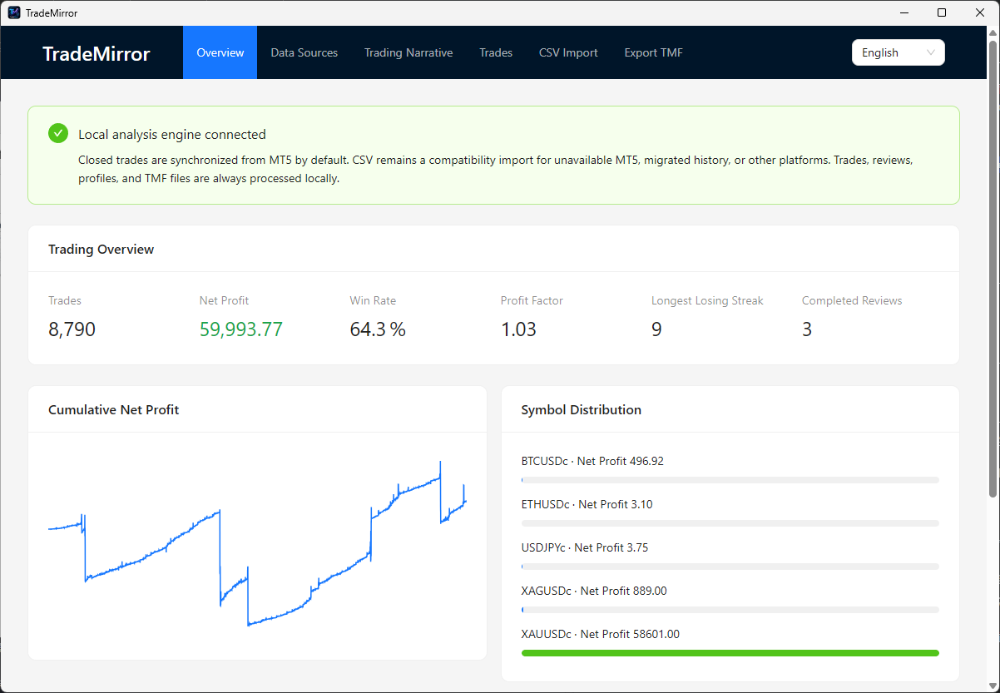
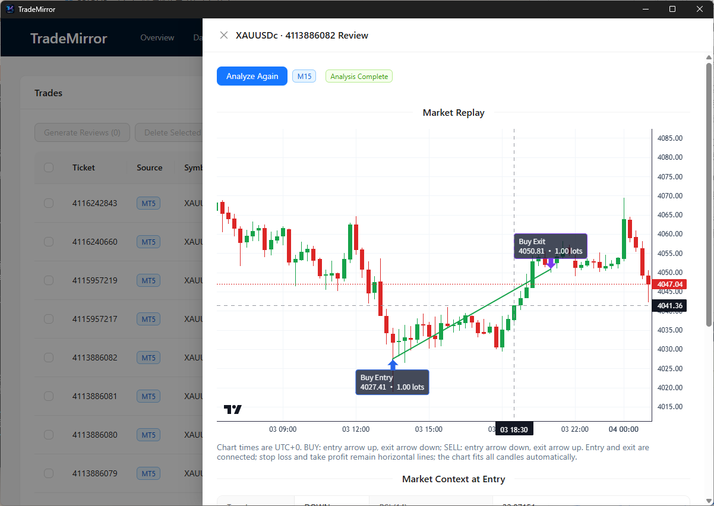
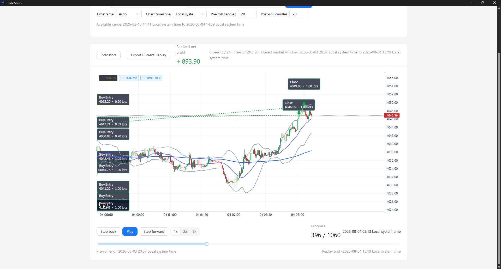
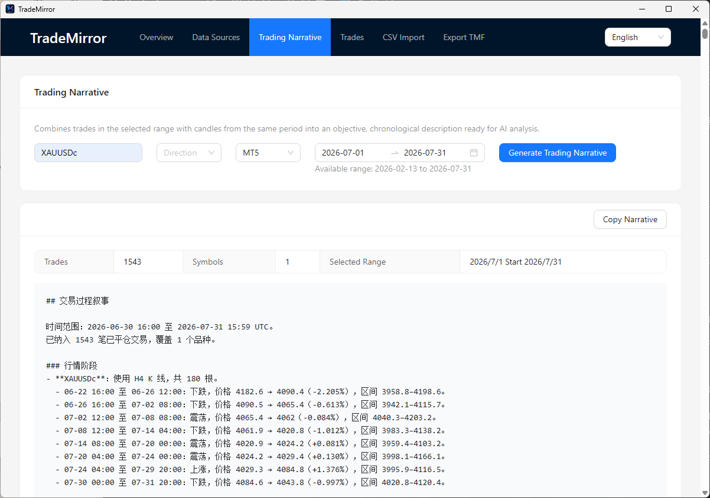
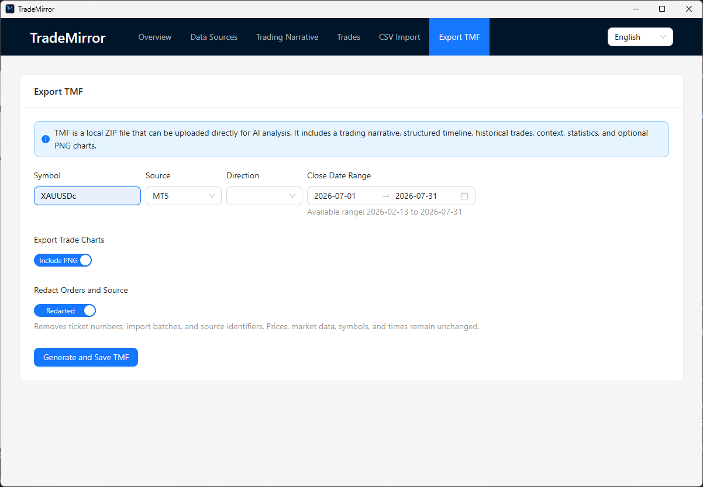

<p align="center">
  
</p>

<h1 align="center">TradeMirror</h1>

<p align="center">
  <strong>连接 MT5，重构交易数据，转化为 AI 可理解的交易洞察</strong><br>
  <strong>Connect with MT5, transform trading data, and turn it into AI-powered trading insights.</strong>
</p>

<p align="center">
  
  
  
  
  
  
</p>

[中文](#中文) · [English](#english)

---

## 下载 / Download

### Windows 免安装绿色版 / Windows Portable Edition

从 [GitHub Releases](https://github.com/zjssun/TradeMirror/releases) 下载最新的 `TradeMirror_Portable_v*.zip`，解压后双击 `TradeMirror.exe` 即可启动。无需安装 Python、Node.js、npm、pip 或数据库。  
Download the latest `TradeMirror_Portable_v*.zip` from [GitHub Releases](https://github.com/zjssun/TradeMirror/releases), extract it, and launch `TradeMirror.exe`. Python, Node.js, npm, pip, and a separate database installation are not required.

---

## 更新历史 / Update History

- **2026-08-03 — 交易复盘播放器 / Trade Replay Player**：新增按时间顺序播放历史 K 线的复盘页面，支持周期与前后市场窗口设置、播放控制、进度跳转、交易标记及动态已实现净收益。  
  Added chronological historical-candle playback with configurable timeframe and market windows, playback controls, seeking, trade markers, and dynamic realized net profit.
- **2026-08-04 — 优化整体和添加一些功能**：
    - 用户可以选择图表中的时区(因为每个经纪商的时区可能不同)。
    - 导出交易图表添加提示"需在交易记录中点击复盘才能生成交易图表"。
    - 优化复盘图表中的交易标签样式。
    - "交易记录"里添加"复盘全部"按钮和"删除全部"按钮。
---

## 中文

### TradeMirror 是什么？

TradeMirror 是一款面向交易复盘的本地桌面软件。它将已平仓交易记录与对应时间范围内的 MT5 K 线数据结合起来，帮助你回看每笔交易发生时的市场环境，并整理为适合交给 AI 进一步分析的交易过程材料。

软件专注于**历史数据整理、复盘和分析**，不是交易终端，也不提供预测、下单或自动交易功能。

### 核心原则

- **本地优先**：本地 FastAPI 引擎、SQLite 数据库和桌面界面协同运行；数据不会被应用自动上传到第三方服务。
- **MT5 只读**：仅读取已平仓历史订单和行情 K 线；不会下单、修改仓位、收集交易账户密码或写入 MT5。
- **MT5 优先，CSV 兼容**：优先从 Windows MetaTrader 5 终端同步历史记录；也支持 CSV 导入，用于历史迁移或其他经纪商/平台导出。
- **控制权在用户**：TMF 导出文件在本地生成；是否将其提交给任意 AI 服务由你自行决定。

### 功能

| 功能 | 说明 |
| --- | --- |
| MT5 已平仓交易同步 | 从已登录的 MT5 终端读取并同步历史已平仓交易，可选择日期范围或全部历史。 |
| CSV 导入 | 预览文件编码、分隔符和样例数据，映射字段后再确认导入。 |
| 交易记录管理 | 按品种、方向、来源和时间筛选；支持单笔或批量删除。 |
| 单笔行情回放 | 将开仓、平仓、止损和止盈标注到 UTC+0 K 线图中，并以方向感知的箭头和连线展示交易过程。 |
| 交易复盘播放器 | 按单一品种和日期范围逐根播放历史 K 线；可设置周期和前后市场窗口、拖动进度条跳转，查看交易标记与随平仓动态变化的已实现净收益。 |
| 批量交易复盘 | 对选中的交易生成分析结果，并展示市场环境、执行表现和数据质量。 |
| 交易过程叙事 | 在指定时间范围内，将交易序列与市场 K 线阶段组织为连续的交易过程文本。 |
| TMF 导出 | 生成本地交易材料文件，可选择是否包含图表以及是否脱敏数据来源身份。 |

### 界面预览 / Screenshots
#### 交易概览 / Trading Overview



在本地汇总交易数量、净利润、胜率、盈亏比、最长连亏和已完成复盘，并展示净利润曲线与品种分布。
Summarizes local trade performance—including trade count, net profit, win rate, profit factor, losing streaks, completed reviews, equity curve, and symbol distribution.
#### 交易记录 / Trade Records



在交易记录中筛选、选择或清理本地交易；打开单笔复盘后，可查看标注开平仓位置、价格和手数的行情图，并检查入场市场环境、执行指标与数据质量。
Filter, select, or clean up local trades in Trade Records. Open an individual review to inspect the market chart with entry/exit position, price, and volume labels, alongside entry context, execution metrics, and data quality.

#### 交易复盘播放器 / Trade Replay Player



选择单一品种与日期范围后，可设置 K 线周期以及交易前/后市场窗口；历史 K 线会按时间顺序播放，也可通过进度条直接跳转。交易开平仓标记、连接线与已实现净收益会随播放位置同步更新。
Select one symbol and a date range, configure the candle timeframe and pre/post market windows, then play candles chronologically or seek directly with the progress bar. Trade markers, paths, and realized net profit update with the replay position.

#### 交易过程叙事 / Trading Narrative



在所选时间范围内，将交易与同一时期的 K 线市场阶段组合为连续、可复制的交易过程描述。
Combines selected trades and candle-market phases into a chronological, copyable account of the trading process.

#### TMF 导出 / TMF Export



导出的TMF文件可以上传给AI进行交易分析，它按品种、来源、方向和日期筛选交易，并选择是否导出图表及脱敏订单与来源标识。
Exported TMF files can be uploaded to AI for trading analysis. It filters trades by symbol, source, direction, and date, while allowing you to choose whether to include charts, anonymized orders, and source identifiers.

### 日常使用

1. **准备 MT5（可选但推荐）**：在 Windows 上安装并登录 MetaTrader 5 终端；启动 TradeMirror 后，在「数据源」检查连接状态。
2. **导入交易历史**：在「数据源」同步 MT5 已平仓交易，选择时间范围或全部历史。重复同步会去重。无法使用 MT5 时，上传 CSV、确认字段映射与预览数据后导入。
3. **浏览与清理交易**：在「交易记录」按品种、方向、来源和日期筛选；可单笔或批量删除。
4. **复盘交易过程**：从交易记录打开单笔复盘，点击「生成分析」或「重新分析」。系统读取所需历史 K 线并生成 UTC+0 行情回放；开仓和平仓箭头落在对应或此前最近的一根 K 线上。
5. **播放交易过程**：打开「交易复盘播放器」，选择品种和日期范围，按需设置 K 线周期及前置/后置 K 线。加载后可先观察入场前行情，再播放、单步或拖动进度条定位；已实现净收益会在平仓 K 线出现时动态更新。
6. **生成时间范围叙事**：在「交易过程叙事」中选择有交易数据的日期范围和筛选条件，得到交易时间线与市场阶段组成的连续文本，可复制到你选择的 AI 工具。
7. **导出 TMF 材料**：在「TMF 导出」设置筛选条件、图表与来源脱敏选项，生成后保存到本地。整个导出过程都在本机完成。

### 运行与开发

#### 前置条件

- Windows 10/11
- Python 3.12 或 3.13
- Node.js（建议使用当前 LTS 版本）
- Rust stable 工具链（用于 Tauri 桌面端）
- MetaTrader 5 Windows 桌面终端（仅 MT5 同步与行情回放需要）

#### 安装依赖

以下示例使用 Git Bash；PowerShell 中请按环境调整虚拟环境命令。

```bash
# 后端引擎
cd engine
python -m venv .venv
./.venv/Scripts/pip install -e ".[dev]"

# 前端
cd ../frontend
npm install
```

#### 启动前端开发服务器

```bash
cd frontend
npm run dev
```

默认开发地址为 `http://localhost:1420`。

#### 启动桌面应用

```bash
cd desktop/tauri
cargo tauri dev
```

#### 验证构建与测试

```bash
# 后端测试
cd engine
./.venv/Scripts/python.exe -m pytest

# 前端生产构建与类型检查
cd frontend
npm run build
```

### 数据与安全说明

- 引擎仅绑定本机回环地址 `127.0.0.1`。
- 桌面端与本地引擎之间使用启动令牌进行通信保护。
- TradeMirror 不会执行任何 MT5 交易操作，也不会读取或保存 MT5 登录凭据。
- 后端生成的叙事、诊断内容和导入的原始业务数据保留其原始语言与语义；界面语言切换仅影响软件自身的固定 UI 文案。
- 请在把交易数据、叙事或 TMF 文件发送至外部 AI 服务前，自行确认该服务的数据处理政策和你的合规要求。

---

## English

### What is TradeMirror?

TradeMirror is a local desktop application for reviewing trading history. It combines closed-trade records with MT5 candlestick data from the relevant time windows, so you can revisit the market context of each trade and prepare structured material for further AI-assisted analysis.

It is designed for **historical-data organization, review, and analysis**. It is not a trading terminal and provides no market forecasting, order placement, or automated execution.

### Core principles

- **Local-first**: the FastAPI engine, SQLite database, and desktop UI run locally. The application does not automatically upload your data to third parties.
- **Read-only MT5 access**: it reads closed-trade history and market candles only. It does not place orders, modify positions, collect account passwords, or write to MT5.
- **MT5 first, CSV compatible**: synchronize history from the Windows MetaTrader 5 terminal when available, with CSV import as a fallback for migration or exports from other brokers and platforms.
- **You control sharing**: TMF export files are generated locally. Whether you provide them to any AI service is entirely your decision.

### Features

| Feature | Description |
| --- | --- |
| MT5 closed-trade sync | Synchronize historical closed trades from a logged-in MT5 terminal, for a date range or all available history. |
| CSV import | Inspect encoding, delimiter, sample rows, and field mappings before confirming an import. |
| Trade management | Filter by symbol, direction, source, and date; delete individual trades or selected batches. |
| Per-trade market replay | Annotate UTC+0 candles with entry, exit, stop-loss, and take-profit markers, using direction-aware arrows and a trade line. |
| Trade Replay Player | Play historical candles for one symbol and a selected date range; configure timeframe and pre/post market windows, seek with a progress bar, and review trade markers with dynamically realized net profit. |
| Batch trade review | Analyze selected trades and inspect market context, execution metrics, and data quality. |
| Trading narrative | Turn a selected period's trades and candle phases into a chronological narrative of the trading process. |
| TMF export | Create local trade-material files, optionally including charts and source-identity redaction. |

### Typical workflow

1. **Prepare MT5 (optional, recommended)**: install and sign in to the MetaTrader 5 terminal on Windows. Start TradeMirror, open **Data Sources**, and check the MT5 connection.
2. **Bring in trade history**: use **Sync MT5 Closed Trades**, selecting a date range or all history. Repeated synchronization is deduplicated. If MT5 is unavailable, import a CSV after reviewing mappings and sample data.
3. **Inspect and curate trades**: open **Trades** and filter by symbol, direction, source, or date; remove invalid records individually or in batches.
4. **Review a trade**: open a trade's review panel, then select **Generate analysis** or **Reanalyze**. The app retrieves the required historical candles and creates a UTC+0 replay. Entry and exit arrows are placed on the matching candle or nearest preceding candle.
5. **Replay a trading period**: open **Trade Replay Player**, select a symbol and date range, then optionally configure the timeframe and pre/post candles. Inspect the pre-entry market window, play or step through the candles, or seek with the progress bar; realized net profit updates when exit candles appear.
6. **Generate a period narrative**: in **Trading Narrative**, select a date range containing trade data and optional filters. The result combines a trade timeline with market phases and can be copied into an AI tool of your choice.
7. **Export TMF material**: in **TMF Export**, configure filters, chart inclusion, and source-identity redaction. Generate the export and save it locally; the export process remains local.

### Run and develop

#### Prerequisites

- Windows 10/11
- Python 3.12 or 3.13
- Node.js (the current LTS release is recommended)
- Rust stable toolchain (for the Tauri desktop host)
- MetaTrader 5 for Windows (needed only for MT5 synchronization and market replay)

#### Install dependencies

The examples below use Git Bash. Adjust virtual-environment commands for PowerShell if needed.

```bash
# Engine
cd engine
python -m venv .venv
./.venv/Scripts/pip install -e ".[dev]"

# Frontend
cd ../frontend
npm install
```

#### Start the frontend development server

```bash
cd frontend
npm run dev
```

The default development URL is `http://localhost:1420`.

#### Start the desktop application

```bash
cd desktop/tauri
cargo tauri dev
```

#### Build the Windows portable edition

On a Windows x64 release machine with Python 3.12+, Node.js, Rust, and the Tauri CLI:

```bat
scripts\package_portable.bat
```

This creates `dist\TradeMirror_Portable_v1.0.zip` and its SHA-256 checksum. End users only extract the ZIP and run `TradeMirror.exe`; they do not need Python, Node.js, npm, pip, or a separately installed database. WebView2 is required by Tauri and is normally present on Windows 10/11.

Runtime data is deliberately outside the extracted directory:

```text
%APPDATA%\TradeMirror\
├── database\trademirror.db
├── tmf\
├── cache\
├── import-previews\
└── logs\engine\engine.log
```

#### Verify tests and builds

```bash
# Engine tests
cd engine
./.venv/Scripts/python.exe -m pytest

# Frontend production build and type checking
cd frontend
npm run build
```

### Data and security notes

- The engine binds only to the local loopback address, `127.0.0.1`.
- A launch token protects communication between the desktop application and local engine.
- TradeMirror never performs MT5 trading actions and does not read or store MT5 login credentials.
- UI language switching affects only static application copy. Backend narratives, diagnostics, and imported business data retain their original language and meaning.
- Before sending trade data, narratives, or TMF files to an external AI service, review that service's data-handling policy and your own compliance obligations.

